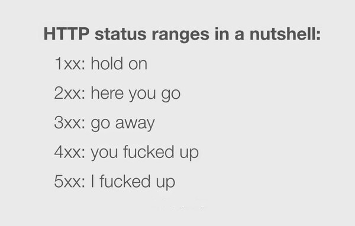

# HTTP Status codes
This is just a collection of common HTTP Status codes, taken from Wikipedia and converted in useful formats for coding.

**Please use in your API!**

---
NOTE: Feel free to notify me opening an issue if you find an error. I'll correct it as soon as possible ;) 
If you like this repo **please add a star** and help it to be findable
